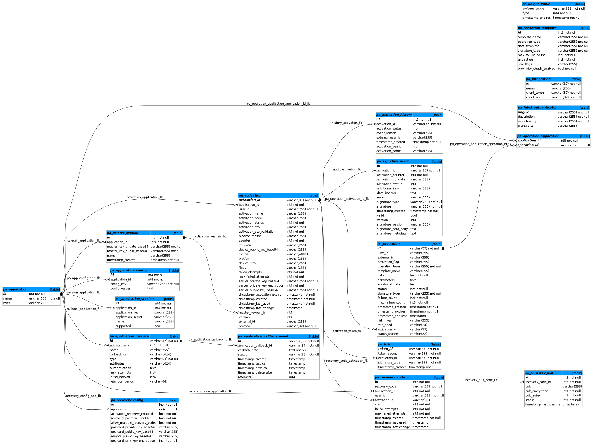

# Database Structure

You can download DDL scripts for supported databases:

- [Oracle - Create Database Schema](./sql/oracle/create_schema.sql)
- [MySQL - Create Database Schema](./sql/mysql/create_schema.sql)
- [PostgreSQL - Create Database Schema](./sql/postgresql/create_schema.sql)

The drop scripts are available for supported databases:
- [Oracle - Drop Tables and Sequences](./sql/oracle/delete_schema.sql)
- [MySQL - Drop Tables](./sql/mysql/delete_schema.sql)
- [PostgreSQL - Drop Tables and Sequences](./sql/postgresql/delete_schema.sql)

See the overall database schema in this [MySQL Workbench file](./sql/mysql/mysql-workbench-model.mwb):

## Table Documentation

This chapter explains individual tables and their columns. The column types are used from MySQL dialect, other databases use types that are equivalent (mapping is usually straight forward).

### Applications Table

Table name: `pa_application`

Purpose: Stores applications used in the PowerAuth Server.

Columns:

| Name | Type | Info | Note |
|------|------|---------|------|
| id | BIGINT(20) | autoincrement | Unique application ID. |
| name | VARCHAR(255) | - | Application name, for example "Mobile Banking". |

### Application Versions Table

Table name: `pa_application_version`

Purpose: Stores application versions for the applications stored in `pa_application` table.

Columns:

| Name | Type | Info | Note |
|------|------|---------|------|
| id | BIGINT(20)  | primary key, autoincrement | Unique application version identifier. |
| application_id | BIGINT(20)  | foreign key: pa\_application.id | Related application ID. |
| name | VARCHAR(255) | - | Version name. |
| application_key | VARCHAR(255) | index | Application key related to this version. Should be indexed to allow a fast lookup, since this is an identifier client applications use. |
| application_secret | VARCHAR(255) | - | Application secret related to this version. |
| supported | INT(11) | - | Flag indicating if this version is supported or not (0 = not supported, 1..N = supported) |

### Activations Table

Table name: `pa_activation`

Purpose: Stores activations. Activation is a unit associating signature / transport and encryption keys to a specific user and application.

Columns:

| Name | Type | Info | Note |
|------|------|---------|------|
| activation_id  | VARCHAR(37) | primary key, UUID (level 4) | Unique activation ID. Uses UUID Level 4 format, for example "099e5e30-47b1-41c7-b49b-3bf28e811fca". |
| activation_code | VARCHAR(255) | index | Activation code used during the activation process. Uses 4x5 characters in Base32 encoding separated by a "-" character, for example "KA4PD-RTIE2-KOP3U-H53EA". |
| activation_otp | VARCHAR(255) | - | Activation OTP value |
| activation_otp_validation | INT(11) | - | Activation OTP validation, can be one of following values:  0 - NONE 1 - ON_KEY_EXCHANGE 2 - ON_COMMIT |
| activation_status  | INT(11) | - | Activation status, can be one of following values:  1 - CREATED 2 - PENDING_COMMIT 3 - ACTIVE 4 - BLOCKED 5 - REMOVED |
| blocked_reason | VARCHAR(255) | - | Reason why activation is blocked (used when activation_status = 4, BLOCKED). |
| activation_name  | VARCHAR(255 | - | Name of the activation, typically a name of the client device, for example "John's iPhone 6" |
| application_id  | BIGINT(20) | foreign key: pa\_application.id | Associated application ID. |
| user_id  | VARCHAR(255) | index | Associated user ID. |
| extras  | TEXT | - | Any application specific information. |
| counter  | BIGINT(20) | - | Activation counter. |
| ctr_data | VARCHAR(255) | - | Activation hash based counter data. |
| device_public_key_base64  | TEXT | - | Device public key, encoded in Base64 encoding. |
| failed_attempts  | BIGINT(20) | - | Number of failed signature verification attempts. |
| max_failed_attempts | BIGINT(20) | - | Number of maximum allowed failed signature verification attempts. After value of "failed_attempts" matches this value, activation becomes blocked (activation_status = 4, BLOCKED) |
| server_private_key_base64 | TEXT | - | Server private key, encoded as Base64 |
| server_private_key_encryption | INT(11) | - | Indication whether server private key is encrypted (0 = no encryption, 1 = AES_HMAC)
| server_public_key_base64 | TEXT | - | Server public key, encoded as Base64 |
| master_keypair_id | BIGINT(20) | foreign key: pa\_master\_keypair.id | Master Key Pair identifier, used during the activation process |
| timestamp_created | DATETIME | - | Timestamp of the record creation. |
| timestamp_activation_expire | DATETIME | - | Timestamp until which the activation must be committed. In case activation is not committed until this period, it will become REMOVED. |
| timestamp_last_used | DATETIME | - | Timestamp of the last signature verification attempt. |
| timestamp_last_change | DATETIME | - | Timestamp of the last signature verification attempt. |
| version | BIGINT(2) | - | Cryptography protocol version. |
| platform | VARCHAR(255) | - | User device platform. |
| device_info | VARCHAR(255) | - | User device information. |

### Master Key Pair Table

Table name: `pa_master_keypair`

Purpose: Stores master key pairs associated with applications and used during the activation process.

Columns:

| Name | Type | Info | Note |
|------|------|---------|------|
| id | BIGINT(20) | primary key, autoincrement | Unique master key pair ID. |
| application_id | BIGINT(20) | foreign key: pa\_application.id | Associated application ID. |
| name | VARCHAR(255) | - | Name of the key pair. |
| master_key_private_base64 | TEXT | - | Private key encoded as Base64 |
| master_key_public_base64 | TEXT | - | Public key encoded as Base64 |
| timestamp_created | DATETIME | - | Timestamp of creation. |

### Signature Audit Records Table

Table name: `pa_signature_audit`

Purpose: Stores records with values used for attempts for the signature validation.

Columns:

| Name | Type | Info | Note |
|------|------|---------|------|
| id | BIGINT(20) | primary key, autoincrement | Unique record ID. |
| activation_id | BIGINT(20) | foreign key: pa\_activation.activation\_id | Associated activation ID. |
| activation_counter | BIGINT(20) | - | Activation counter at the moment of signature validation. |
| activation_ctr_data | BIGINT(2) | - | Activation hash based counter data at the moment of signature validation. |
| activation_status | INT(11) | - | Activation status at the moment of signature validation. |
| additional_info | VARCHAR(255) | - | Additional information related to the signature request in JSON format. |
| data_base64 | TEXT | - | Data passed as the base for the signature, encoded as Base64. |
| signature_type | VARCHAR(255) | - | Requested type of the signature. |
| signature | VARCHAR(255) | - | Provided value of the signature. |
| valid | INT(11) | - | Flag indicating if the provided signature was valid. |
| note | TEXT | - | Additional information about the validation result. |
| timestamp_created | DATETIME | index | A timestamp of the validation attempt. |
| version | BIGINT(2) | - | PowerAuth protocol version. |

### Integration Credentials Table

Table name: `pa_integration`

Purpose: Stores credentials for applications that integrate with PowerAuth Server.

Columns:

| Name | Type | Info | Note |
|------|------|---------|------|
| id | VARCHAR(37) | primary key | Unique integration ID, UUID Level 4 format. |
| name | VARCHAR(255) | - | Integration name, anything that visually identifies the associated application. |
| client_token | VARCHAR(37) | index | Integration username, UUID Level 4 format. |
| client_secret | VARCHAR(37) | - | Integration password, UUID Level 4 format. |

### Application Callback URL Table

Table name: `pa_application_callback`

Purpose: Stores callback URLs - per-application endpoints that are notified whenever an activation status changes.

Columns:

| Name | Type | Info | Note |
|------|------|---------|------|
| id | VARCHAR(37) | primary key | Unique callback URL identifier, UUID Level 4 format. |
| application_id | BIGINT(20) | foreign key: pa\_application.id | Associated application ID. |
| name | VARCHAR(255) | - | Callback name, anything that visually identifies the callback purpose. |
| callback_url | TEXT | - | Callback URL value, any URL that can receive activation update callback. |

### Token Store Table

Table name: `pa_token`

Purpose: Stores tokens used for token-based authentication.

Columns:

| Name | Type | Info | Note |
|------|------|---------|------|
| token_id | VARCHAR(37) | primary key | Unique identifier of the token. |
| token_secret | VARCHAR(255) | - | Secret value used for computing the token digest. |
| activation_id | VARCHAR(37) | foreign key: pa\_activation.activation_id | Reference to associated activation. |
| signature_type | VARCHAR(255) | - | Type of the signature that was used to issue this token. |
| timestamp_created | DATETIME | - | Timestamp of the record creation. |

### Activation History Table

Table name: `pa_activation_history`

Purpose: Stores a log of activation changes.

Columns:

| Name | Type | Info | Note |
|------|------|---------|------|
| id | INT(37) | primary key | Unique record ID. |
| activation_id | VARCHAR(37) | foreign key: pa\_activation.activation_id | Reference to associated activation. |
| activation_status | INT(11) | index | Activation status, can be one of following values:  1 - CREATED 2 - PENDING_COMMIT 3 - ACTIVE 4 - BLOCKED 5 - REMOVED |
| blocked_reason | VARCHAR(255) | - | Reason why activation was blocked (used when activation_status = 4, BLOCKED). |
| external_user_id | VARCHAR(255) | - | External user ID of user who caused change of the activation (e.g. banker user ID). In case the value is null the change was caused by the user associated with the activation. |
| timestamp_created | DATETIME | - | Timestamp of the record creation. |

### Recovery Code Table

Table name: `pa_recovery_code`

Purpose: Stores information about recovery codes.

Columns:

| Name | Type | Info | Note |
|------|------|---------|------|
| id | INT(37) | primary key | Unique record ID. |
| recovery_code | VARCHAR(23) | index | Recovery code used for recovering an activation. Uses 4x5 characters in Base32 encoding separated by a "-" character, for example "KA4PD-RTIE2-KOP3U-H53EA". |
| application_id | BIGINT(20)  | foreign key: pa\_application.id | Related application ID. |
| user_id  | VARCHAR(255) | index | Associated user ID. |
| activation_id | VARCHAR(37) | foreign key: pa\_activation.activation_id | Reference to associated activation. |
| status  | INT(11) | - | Recovery code status, can be one of following values:  1 - CREATED 2 - ACTIVE 3 - BLOCKED 4 - REVOKED |
| failed_attempts  | BIGINT(20) | - | Number of failed activation recovery attempts. |
| max_failed_attempts | BIGINT(20) | - | Number of maximum allowed failed activation recovery attempts. After value of "failed_attempts" matches this value, recovery code becomes blocked (status = 3, BLOCKED) |
| timestamp_created | DATETIME | - | Timestamp of record creation. |
| timestamp_last_used | DATETIME | - | Timestamp of record last usage. |
| timestamp_last_change | DATETIME | - | Timestamp of record last change. |

### Recovery PUK Table

Table name: `pa_recovery_puk`

Purpose: Stores information about recovery PUKs.

Columns:

| Name | Type | Info | Note |
|------|------|---------|------|
| id | INT(37) | primary key | Unique record ID. |
| recovery_code_id | INT(37) | foreign key: pa_recovery_code.id, index | Related recovery code. |
| puk | VARCHAR(255) | - | Recovery PUK value (optionally encrypted). |
| puk_encryption | INT(11) | - | Encryption type for PUK (0 = NO_ENCRYPTION, 1 = AES_HMAC) |
| puk_index | INT(11) | index | Index of the PUK (value starts by 1). |
| status | INT(11) | - | Recovery PUK status, can be one of following values:   1 - VALID 2 - USED 3 - INVALID |
| timestamp_last_change | DATETIME | - | Timestamp of record last change. |

### Recovery Configuration Table

Table name: `pa_recovery_config`

Purpose: Stores configuration of activation recovery and recovery postcards.

Columns:

| Name | Type | Info | Note |
|------|------|---------|------|
| id | INT(37) | primary key | Unique record ID. |
| application_id | BIGINT(20)  | foreign key: pa\_application.id | Related application ID. |
| activation_recovery_enabled | INT(1) | - | Whether activation recovery is enabled. |
| recovery_postcard_enabled | INT(1) | - | Whether recovery postcard is enabled. |
| allow_multiple_recovery_codes | INT(1) | - | Whether multiple recovery codes are allowed per user. |
| postcard_private_key_base64 | VARCHAR(255) | - | Base64 encoded EC server private key for recovery postcard. |
| postcard_public_key_base64 | VARCHAR(255) | - | Base64 encoded EC server public key for recovery postcard. |
| remote_public_key_base64 | VARCHAR(255) | - | Base64 encoded EC printing center public key for recovery postcard. |
