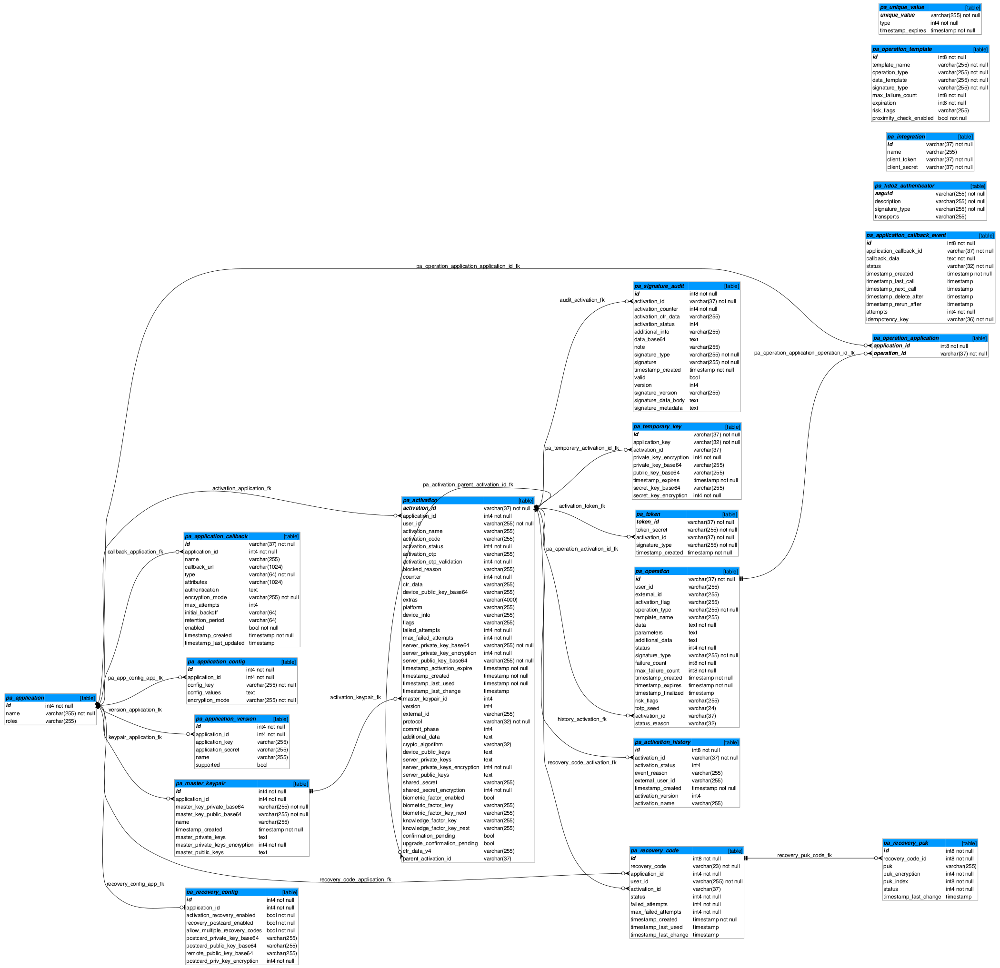

# Database Structure

<!-- TEMPLATE database -->

You can download DDL scripts for supported databases:

- [Oracle - Create Database Schema](./sql/oracle/create_schema.sql)
- [PostgreSQL - Create Database Schema](./sql/postgresql/create_schema.sql)
- [MS SQL - Create Database Schema](./sql/mssql/create_schema.sql)

See the overall database schema:

## ShedLock

The PowerAuth Server uses ShedLock to synchronize scheduled operations.
See the [SchedLock documentation](https://github.com/lukas-krecan/ShedLock#jdbctemplate) for the details.

## Table Documentation

This chapter explains individual tables and their columns. The column types are used from PostgreSQL dialect, other databases use types that are equivalent (mapping is usually straight forward).

<!-- begin database table pa_application -->
### Applications Table

Stores applications used in the PowerAuth Server.

#### Columns

| Name  | Type         | Info                   | Note                                                  |
|-------|--------------|------------------------|-------------------------------------------------------|
| id    | INTEGER      | primary key, sequence  | Unique application record ID.                         |
| name  | VARCHAR(255) | NOT NULL, unique index | Application identifier, for example "mobile-banking". |
| roles | VARCHAR(255) | -                      | Application roles as a JSON array.                    |
<!-- end -->

<!-- begin database table pa_application_version -->
### Application Versions Table

Stores application versions for the applications stored in `pa_application` table.

#### Columns

| Name               | Type         | Info                                             | Note                                                                                                                    |
|--------------------|--------------|--------------------------------------------------|-------------------------------------------------------------------------------------------------------------------------|
| id                 | INTEGER      | primary key, sequence                            | Unique application version identifier.                                                                                  |
| application_id     | INTEGER      | foreign key: pa\_application.id, NOT NULL, index | Related application ID.                                                                                                 |
| name               | VARCHAR(255) | -                                                | Version identifier.                                                                                                     |
| application_key    | VARCHAR(255) | unique index                                     | Application key related to this version. Indexed for fast lookup, since this is the identifier client applications use. |
| application_secret | VARCHAR(255) | -                                                | Application secret related to this version.                                                                             |
| supported          | BOOLEAN      | -                                                | Flag indicating if this version is supported or not.                                                                    |
<!-- end -->

<!-- begin database table pa_application_config -->
### Application Configuration Table

Stores configuration records for applications defined in the `pa_application` table.

#### Columns

| Name            | Type         | Info                                                  | Note                                                                                                                                                                                                                                      |
|-----------------|--------------|-------------------------------------------------------|-------------------------------------------------------------------------------------------------------------------------------------------------------------------------------------------------------------------------------------------|
| id              | INTEGER      | primary key, sequence                                 | Unique application configuration identifier.                                                                                                                                                                                              |
| application_id  | INTEGER      | foreign key: pa\_application.id                       | Related application ID.                                                                                                                                                                                                                   |
| config_key      | VARCHAR(255) | index, NOT NULL                                       | Configuration key names: `fido2_attestation_fmt_allowed`, `fido2_aaguids_allowed`, `fido2_root_ca_certs`, `oauth2_providers`, `cryptography_algorithms_supported`, `disable_biometry_unlock_kek_device_private`, or `activation_transfer` |
| config_values   | TEXT         | -                                                     | Configuration values serialized in JSON format.                                                                                                                                                                                           |
| encryption_mode | VARCHAR(255) | NOT NULL, DEFAULT 'NO_ENCRYPTION'                     | Encryption mode for stored values: `NO_ENCRYPTION` (plaintext), `AES_HMAC` (legacy), or `AEAD_KMAC` (current).                                                                                                                            |
<!-- end -->

<!-- begin database table pa_activation -->
### Activations Table

Stores activations. Activation is a unit associating signature / transport and encryption keys to a specific user and application.

#### Columns

| Name                          | Type          | Info                                             | Note                                                                                                                                                                                     |
|-------------------------------|---------------|--------------------------------------------------|------------------------------------------------------------------------------------------------------------------------------------------------------------------------------------------|
| activation_id                 | VARCHAR(37)   | primary key, UUID (level 4)                      | Unique activation ID. Uses UUID Level 4 format, for example "099e5e30-47b1-41c7-b49b-3bf28e811fca".                                                                                      |
| application_id                | INTEGER       | NOT NULL, foreign key: pa\_application.id, index | Associated application ID.                                                                                                                                                               |
| user_id                       | VARCHAR(255)  | NOT NULL, index                                  | Associated user ID.                                                                                                                                                                      |
| activation_name               | VARCHAR(255)  | -                                                | Name of the activation, typically a name of the client device, for example "John's iPhone 6"                                                                                             |
| activation_code               | VARCHAR(255)  | index                                            | Activation code used during the activation process. Uses 4x5 characters in Base32 encoding separated by a "-" character, for example "KA4PD-RTIE2-KOP3U-H53EA".                          |
| activation_status             | INTEGER       | NOT NULL, composite index                        | Activation status: 1=CREATED, 2=PENDING_COMMIT, 3=ACTIVE, 4=BLOCKED, 5=REMOVED.                                                                                                          |
| activation_otp                | VARCHAR(255)  | -                                                | Activation OTP value.                                                                                                                                                                    |
| activation_otp_validation     | INTEGER       | NOT NULL, DEFAULT 0                              | OTP validation mode: 0=NONE, 1=ON_KEY_EXCHANGE, 2=ON_COMMIT.                                                                                                                             |
| blocked_reason                | VARCHAR(255)  | -                                                | Reason why activation is blocked (used when activation_status = 4, BLOCKED).                                                                                                             |
| counter                       | INTEGER       | NOT NULL                                         | Activation counter (legacy).                                                                                                                                                             |
| ctr_data                      | VARCHAR(255)  | -                                                | Hash-based counter data (legacy), Base64-encoded.                                                                                                                                        |
| device_public_key_base64      | VARCHAR(255)  | -                                                | Device public key (legacy), Base64-encoded.                                                                                                                                              |
| device_public_key_id          | BIGINT        | foreign key: pa\_device\_public\_key.id          | ID of the associated device public keys for V4 algorithms.                                                                                                                               |
| server_private_key_base64     | VARCHAR(255)  | -                                                | Server private key (legacy), Base64-encoded.                                                                                                                                             |
| server_private_key_encryption | INTEGER       | NOT NULL, DEFAULT 0                              | Encryption of legacy server private key: 0=NO_ENCRYPTION, 1=AES_HMAC (legacy), 2=AEAD_KMAC (current).                                                                                    |
| server_public_key_base64      | VARCHAR(255)  | -                                                | Server public key (legacy), Base64-encoded.                                                                                                                                              |
| server_private_key_id         | BIGINT        | foreign key: pa\_server\_private\_key.id         | ID of the associated server private keys for V4 algorithms.                                                                                                                              |
| server_public_key_id          | BIGINT        | foreign key: pa\_server\_public\_key.id          | ID of the associated server public keys for V4 algorithms.                                                                                                                               |
| activation_fingerprint        | VARCHAR(255)  | -                                                | Fingerprint of the activation.                                                                                                                                                           |
| shared_secret                 | VARCHAR(255)  | -                                                | Derived shared secret value.                                                                                                                                                             |
| shared_secret_encryption      | INTEGER       | NOT NULL, DEFAULT 0                              | Encryption for `shared_secret`: 0=NO_ENCRYPTION, 1=AES_HMAC (legacy), 2=AEAD_KMAC (current).                                                                                             |
| biometric_factor_enabled      | BOOLEAN       | DEFAULT FALSE                                    | Indication whether biometric factor is enabled                                                                                                                                           |
| biometric_factor_key_next     | VARCHAR(255)  | -                                                | Next biometry factor key                                                                                                                                                                 |
| knowledge_factor_key          | VARCHAR(255)  | -                                                | Current knowledge factor key                                                                                                                                                             |
| knowledge_factor_key_next     | VARCHAR(255)  | -                                                | Next knowledge factor key                                                                                                                                                                |
| extras                        | VARCHAR(4000) | -                                                | Any application specific information.                                                                                                                                                    |
| platform                      | VARCHAR(255)  | -                                                | User device platform.                                                                                                                                                                    |
| device_info                   | VARCHAR(255)  | -                                                | User device information.                                                                                                                                                                 |
| flags                         | VARCHAR(255)  | -                                                | Activation flags as a JSON array.                                                                                                                                                        |
| external_id                   | VARCHAR(255)  | -                                                | External identifier related to the activation.                                                                                                                                           |
| protocol                      | VARCHAR(32)   | NOT NULL, DEFAULT 'powerauth'                    | Security protocol: `powerauth` (default) or `fido2`.                                                                                                                                     |
| failed_attempts               | INTEGER       | NOT NULL                                         | Number of failed authentication verification attempts.                                                                                                                                   |
| max_failed_attempts           | INTEGER       | NOT NULL, DEFAULT 5                              | Number of maximum allowed failed authentication verification attempts. After value of "failed_attempts" matches this value, activation becomes blocked (activation_status = 4, BLOCKED). |
| timestamp_activation_expire   | TIMESTAMP(6)  | NOT NULL, composite index                        | Timestamp until which the activation must be committed. In case activation is not committed until this period, it will become REMOVED.                                                   |
| timestamp_created             | TIMESTAMP(6)  | NOT NULL                                         | Timestamp of the record creation.                                                                                                                                                        |
| timestamp_last_used           | TIMESTAMP(6)  | NOT NULL                                         | Timestamp of the last authentication verification attempt.                                                                                                                               |
| timestamp_last_change         | TIMESTAMP(6)  | -                                                | Timestamp of the last activation modification.                                                                                                                                           |
| version                       | INTEGER       | NOT NULL, DEFAULT 2                              | Cryptography protocol version.                                                                                                                                                           |
| commit_phase                  | INTEGER       | DEFAULT 0                                        | Commit phase behavior: 0 = ON_COMMIT (default), 1 = ON_KEY_EXCHANGE.                                                                                                                     |
| additional_data               | TEXT          | -                                                | Optional additional data, structure is customer-specific JSON. Could be set during creation or initialization.                                                                           |
| crypto_algorithm              | VARCHAR(32)   | -                                                | Cryptography algorithm used during activation.                                                                                                                                           |
| confirmation_pending          | BOOLEAN       | DEFAULT FALSE                                    | Whether an activation confirmation is pending.                                                                                                                                           |
| upgrade_confirmation_pending  | BOOLEAN       | DEFAULT FALSE                                    | Whether an upgrade confirmation is pending.                                                                                                                                              |
| ctr_data_v4                   | VARCHAR(255)  | -                                                | Counter data used by cryptography protocol v4.                                                                                                                                           |
| parent_activation_id          | VARCHAR(37)   | -                                                | The parent activation ID. Mandatory when `transfer_type` is present.                                                                                                                     |
| transfer_type                 | VARCHAR(32)   | -                                                | The activation transfer type (`SPAWN`, or `MOVE`). Mandatory when `parent_activation_id` is present.                                                                                     |
| master_keypair_id             | INTEGER       | foreign key: pa\_master\_keypair.id, index       | Master key pair used during activation.                                                                                                                                                  |
<!-- end -->

<!-- begin database table pa_master_keypair -->
### Master Key Pair Table

Stores master key pairs associated with applications and used during the activation process.

#### Columns

| Name                           | Type         | Info                                   | Note                                                                     |
|--------------------------------|--------------|----------------------------------------|--------------------------------------------------------------------------|
| id                             | INTEGER      | primary key, sequence                  | Unique master key pair ID.                                               |
| application_id                 | INTEGER      | foreign key: pa\_application.id, index | Associated application ID.                                               |
| name                           | VARCHAR(255) | -                                      | Name of the key pair.                                                    |
| master_key_private_base64      | VARCHAR(255) | -                                      | Legacy private key encoded as Base64.                                    |
| master_key_public_base64       | VARCHAR(255) | -                                      | Legacy public key encoded as Base64.                                     |
| master_private_keys            | CLOB         | -                                      | Private keys used for newer cryptography algorithms serialized as JSON.  |
| master_private_keys_encryption | INTEGER      | NOT NULL, DEFAULT 0                    | Encryption: 0=NO_ENCRYPTION, 1=AES_HMAC (legacy), 2=AEAD_KMAC (current). |
| master_public_keys             | CLOB         | -                                      | Public keys used for newer cryptography algorithms serialized as JSON.   |
| timestamp_created              | TIMESTAMP(6) | NOT NULL                               | Timestamp of creation.                                                   |
<!-- end -->

<!-- begin database table pa_signature_audit -->
### Signature Audit Records Table

Stores the records with values used for attempts for the signature validation.

#### Columns

| Name                | Type         | Info                                              | Note                                                                      |
|---------------------|--------------|---------------------------------------------------|---------------------------------------------------------------------------|
| id                  | BIGINT       | primary key, sequence                             | Unique record ID.                                                         |
| activation_id       | VARCHAR(37)  | foreign key: pa\_activation.activation\_id, index | Associated activation ID.                                                 |
| activation_counter  | INTEGER      | NOT NULL                                          | Activation counter at the moment of signature validation.                 |
| activation_ctr_data | VARCHAR(255) | -                                                 | Activation hash based counter data at the moment of signature validation. |
| activation_status   | INTEGER      | -                                                 | Activation status at the moment of signature validation.                  |
| additional_info     | VARCHAR(255) | -                                                 | Additional information related to the signature request in JSON format.   |
| data_base64         | TEXT         | -                                                 | Data passed as the base for the signature, encoded as Base64.             |
| signature_type      | VARCHAR(255) | NOT NULL                                          | Requested type of the signature.                                          |
| signature           | VARCHAR(255) | NOT NULL                                          | Provided value of the signature.                                          |
| signature_metadata  | CLOB         | -                                                 | JSON with signature metadata related to the signature calculation.        |
| signature_data_body | CLOB         | -                                                 | Data used for the signature verification.                                 |
| valid               | BOOLEAN      | -                                                 | Flag indicating if the provided signature was valid.                      |
| note                | VARCHAR(255) | -                                                 | Additional information about the validation result.                       |
| timestamp_created   | TIMESTAMP(6) | NOT NULL, index                                   | A timestamp of the validation attempt.                                    |
| version             | INTEGER      | DEFAULT 2                                         | PowerAuth protocol version.                                               |
| signature_version   | VARCHAR(255) | -                                                 | PowerAuth signature version.                                              |
<!-- end -->

<!-- begin database table pa_integration -->
### Integration Credentials Table

Stores credentials for applications that integrate with PowerAuth Server.

#### Columns

| Name          | Type         | Info                        | Note                                                                            |
|---------------|--------------|-----------------------------|---------------------------------------------------------------------------------|
| id            | VARCHAR(37)  | primary key, UUID (level 4) | Unique integration ID, UUID Level 4 format.                                     |
| name          | VARCHAR(255) | -                           | Integration name, anything that visually identifies the associated application. |
| client_token  | VARCHAR(37)  | NOT NULL, unique index      | Integration username, UUID Level 4 format.                                      |
| client_secret | VARCHAR(37)  | NOT NULL                    | Integration password, UUID Level 4 format.                                      |
<!-- end -->

<!-- begin database table pa_application_callback -->
### Application Callback URL Table

Stores callback URLs - per-application endpoints that are notified whenever an activation or operation status changes.

#### Columns

| Name                   | Type          | Info                                   | Note                                                                                                                       |
|------------------------|---------------|----------------------------------------|----------------------------------------------------------------------------------------------------------------------------|
| id                     | VARCHAR(37)   | primary key, UUID (level 4)            | Unique callback URL identifier, UUID Level 4 format.                                                                       |
| application_id         | INTEGER       | foreign key: pa\_application.id, index | Associated application ID.                                                                                                 |
| name                   | VARCHAR(255)  | -                                      | Callback name, anything that visually identifies the callback purpose.                                                     |
| callback_url           | VARCHAR(1024) | -                                      | Callback URL value, any URL that can receive activation update callback.                                                   |
| type                   | VARCHAR(64)   | DEFAULT ACTIVATION_STATUS_CHANGE       | Callback type: `ACTIVATION_STATUS_CHANGE` or `OPERATION_STATUS_CHANGE`.                                                    |
| attributes             | VARCHAR(1024) | -                                      | Callback attributes as a key-value map, serialized into JSON.                                                              |
| authentication         | TEXT          | -                                      | Callback HTTP request authentication configuration, serialized into JSON.                                                  |
| encryption_mode        | VARCHAR(255)  | NOT NULL, DEFAULT 'NO_ENCRYPTION'      | Encryption of authentication values: `NO_ENCRYPTION` means plaintext, `AES_HMAC` for AES encryption with HMAC-based index. |
| max_attempts           | INTEGER       | -                                      | Maximum number of attempts to dispatch a callback.                                                                         |
| initial_backoff        | VARCHAR(64)   | -                                      | Initial backoff period before the next send attempt, stored as a ISO 8601 string.                                          |
| retention_period       | VARCHAR(64)   | -                                      | Minimal duration for which is a completed callback event persisted, stored as a ISO 8601 string.                           |
| enabled                | BOOLEAN       | DEFAULT TRUE                           | Indicator specifying whether the Callback URL should be used.                                                              |
| timestamp_created      | TIMESTAMP(6)  | NOT NULL, DEFAULT NOW()                | Timestamp when the record was created.                                                                                     |
| timestamp_last_updated | TIMESTAMP(6)  | -                                      | Timestamp of the last update of the record via the Callback Management API.                                                |
<!-- end -->

<!-- begin database table pa_token -->
### Token Store Table

Stores tokens used for token-based authentication.

#### Columns

| Name              | Type         | Info                                             | Note                                                     |
|-------------------|--------------|--------------------------------------------------|----------------------------------------------------------|
| token_id          | VARCHAR(37)  | primary key, UUID (level 4)                      | Unique identifier of the token.                          |
| token_secret      | VARCHAR(255) | NOT NULL                                         | Secret value used for computing the token digest.        |
| activation_id     | VARCHAR(37)  | foreign key: pa\_activation.activation_id, index | Reference to associated activation.                      |
| signature_type    | VARCHAR(255) | -                                                | Type of the signature that was used to issue this token. |
| timestamp_created | TIMESTAMP(6) | -                                                | Timestamp of the record creation.                        |
<!-- end -->

<!-- begin database table pa_activation_history -->
### Activation History Table

Stores a log of activation changes.

#### Columns

| Name               | Type         | Info                                             | Note                                                                                                                                                                            |
|--------------------|--------------|--------------------------------------------------|---------------------------------------------------------------------------------------------------------------------------------------------------------------------------------|
| id                 | BIGINT       | primary key, sequence                            | Unique record ID.                                                                                                                                                               |
| activation_id      | VARCHAR(37)  | foreign key: pa\_activation.activation_id, index | Reference to associated activation.                                                                                                                                             |
| activation_status  | INTEGER      | index                                            | Activation status, can be one of following values:  1 - CREATED 2 - PENDING_COMMIT 3 - ACTIVE 4 - BLOCKED 5 - REMOVED                                         |
| event_reason       | VARCHAR(255) | -                                                | Reason why activation was changed.                                                                                                                                              |
| external_user_id   | VARCHAR(255) | -                                                | External user ID of user who caused change of the activation (e.g. banker user ID). In case the value is null the change was caused by the user associated with the activation. |
| timestamp_created  | TIMESTAMP(6) | NOT NULL, index                                  | Timestamp of the record creation.                                                                                                                                               |
| activation_version | INTEGER      | -                                                | Activation version                                                                                                                                                              |
| activation_name    | VARCHAR(255) | -                                                | Activation name.                                                                                                                                                                |
<!-- end -->

<!-- begin database table pa_recovery_code -->
### Recovery Code Table

Stores information about recovery codes.

#### Columns

| Name                  | Type         | Info                                             | Note                                                                                                                                                                    |
|-----------------------|--------------|--------------------------------------------------|-------------------------------------------------------------------------------------------------------------------------------------------------------------------------|
| id                    | BIGINT       | primary key, sequence                            | Unique record ID.                                                                                                                                                       |
| recovery_code         | VARCHAR(23)  | NOT NULL, index                                  | Recovery code used for recovering an activation. Uses 4x5 characters in Base32 encoding separated by a "-" character, for example "KA4PD-RTIE2-KOP3U-H53EA".            |
| application_id        | INTEGER      | foreign key: pa\_application.id, index           | Related application ID.                                                                                                                                                 |
| user_id               | VARCHAR(255) | NOT NULL, index                                  | Associated user ID.                                                                                                                                                     |
| activation_id         | VARCHAR(37)  | foreign key: pa\_activation.activation_id, index | Reference to associated activation.                                                                                                                                     |
| status                | INTEGER      | NOT NULL, DEFAULT 0                              | Recovery code status, can be one of following values:  1 - CREATED 2 - ACTIVE 3 - BLOCKED 4 - REVOKED                                                    |
| failed_attempts       | INTEGER      | NOT NULL, DEFAULT 0                              | Number of failed activation recovery attempts.                                                                                                                          |
| max_failed_attempts   | INTEGER      | NOT NULL, DEFAULT 10                             | Number of maximum allowed failed activation recovery attempts. After value of "failed_attempts" matches this value, recovery code becomes blocked (status = 3, BLOCKED) |
| timestamp_created     | TIMESTAMP(6) | -                                                | Timestamp of record creation.                                                                                                                                           |
| timestamp_last_used   | TIMESTAMP(6) | -                                                | Timestamp of record last usage.                                                                                                                                         |
| timestamp_last_change | TIMESTAMP(6) | -                                                | Timestamp of record last change.                                                                                                                                        |
<!-- end -->

<!-- begin database table pa_recovery_puk -->
### Recovery PUK Table

Stores information about recovery PUKs.

#### Columns

| Name                  | Type         | Info                                                       | Note                                                                                              |
|-----------------------|--------------|------------------------------------------------------------|---------------------------------------------------------------------------------------------------|
| id                    | BIGINT       | primary key, sequence                                      | Unique record ID.                                                                                 |
| recovery_code_id      | BIGINT       | foreign key: pa\_recovery\_code.id, unique composite index | Related recovery code.                                                                            |
| puk                   | VARCHAR(255) | -                                                          | Recovery PUK value (optionally encrypted).                                                        |
| puk_encryption        | INTEGER      | NOT NULL, DEFAULT 0                                        | Encryption type for PUK (0 = NO_ENCRYPTION, 1 = AES_HMAC)                                         |
| puk_index             | BIGINT       | NOT NULL, unique composite index                           | Index of the PUK (value starts by 1).                                                             |
| status                | INTEGER      | NOT NULL                                                   | Recovery PUK status, can be one of following values:   1 - VALID 2 - USED 3 - INVALID |
| timestamp_last_change | TIMESTAMP(6) | -                                                          | Timestamp of record last change.                                                                  |
<!-- end -->

<!-- begin database table pa_recovery_config -->
### Recovery Configuration Table

Stores configuration of activation recovery and recovery postcards.

#### Columns

| Name                          | Type         | Info                                          | Note                                                                |
|-------------------------------|--------------|-----------------------------------------------|---------------------------------------------------------------------|
| id                            | INTEGER      | primary key, sequence                         | Unique record ID.                                                   |
| application_id                | INTEGER      | foreign key: pa\_application.id, unique index | Related application ID.                                             |
| activation_recovery_enabled   | BOOLEAN      | NOT NULL, DEFAULT false                       | Whether activation recovery is enabled.                             |
| recovery_postcard_enabled     | BOOLEAN      | NOT NULL, DEFAULT false                       | Whether recovery postcard is enabled.                               |
| allow_multiple_recovery_codes | BOOLEAN      | NOT NULL, DEFAULT false                       | Whether multiple recovery codes are allowed per user.               |
| postcard_private_key_base64   | VARCHAR(255) | -                                             | Base64 encoded EC server private key for recovery postcard.         |
| postcard_public_key_base64    | VARCHAR(255) | -                                             | Base64 encoded EC server public key for recovery postcard.          |
| remote_public_key_base64      | VARCHAR(255) | -                                             | Base64 encoded EC printing center public key for recovery postcard. |
| postcard_priv_key_encryption  | INTEGER      | NOT NULL, DEFAULT 0                           | Private key encryption mode; 0 for no-encryption, 1 for AES_HMAC.   |
<!-- end -->

<!-- begin database table pa_operation -->
### Operations

Table stores operations, i.e., the login attempts or payment approvals, that are created in external systems.

#### Columns

| Name                | Type         | Info                                  | Note                                                                                                                             |
|---------------------|--------------|---------------------------------------|----------------------------------------------------------------------------------------------------------------------------------|
| id                  | VARCHAR(37)  | primary key                           | Unique operation ID.                                                                                                             |
| user_id             | VARCHAR(255) | index                                 | Related user ID.                                                                                                                 |
| template_name       | VARCHAR(255) | index                                 | Template name used for creating the operation.                                                                                   |
| external_id         | VARCHAR(255) | -                                     | Identifier in external system.                                                                                                   |
| activation_flag     | VARCHAR(255) | -                                     | Activation flag.                                                                                                                 |
| operation_type      | VARCHAR(255) | NOT NULL                              | Name of the type of operation.                                                                                                   |
| data                | TEXT         | NOT NULL                              | Data of the operation that enter the final signature.                                                                            |
| parameters          | TEXT         | -                                     | JSON-encoded parameters that were used while creating the operation.                                                             |
| additional_data     | TEXT         | -                                     | Allow storing operation context.                                                                                                 |
| status              | INTEGER      | NOT NULL, composite index             | Status of the operation.                                                                                                         |
| status_reason       | VARCHAR(32)  | -                                     | Optional details why the status changed. The value should be sent in the form of a computer-readable code, not a free-form text. |
| signature_type      | VARCHAR(255) | NOT NULL                              | Comma-separated list of allowed signature types.                                                                                 |
| failure_count       | BIGINT       | NOT NULL, DEFAULT 0                   | Number of already failed attempts to approve the operation.                                                                      |
| max_failure_count   | BIGINT       | NOT NULL                              | Maximum allowed number of failed attempts when approving the operation.                                                          |
| timestamp_created   | TIMESTAMP    | NOT NULL, index                       | Timestamp of when the operation was created.                                                                                     |
| timestamp_expires   | TIMESTAMP    | NOT NULL, index, composite index      | Timestamp of when the operation will expire.                                                                                     |
| timestamp_finalized | TIMESTAMP    | -                                     | Timestamp of when the operation reached the terminal state (approved, rejected, expired, etc.).                                  |
| risk_flags          | VARCHAR(255) | -                                     | Risk flags for offline QR code. Uppercase letters without separator, e.g. `XFC`.                                                 |
| totp_seed           | VARCHAR(24)  | -                                     | Optional TOTP seed used for proximity check, base64 encoded.                                                                     |
| activation_id       | VARCHAR(37)  | foreign key: pa\_activation.id, index | Activation ID, a foreign key.                                                                                                    |
<!-- end -->

<!-- begin database table pa_operation_template -->
### Operation Templates

Table stores operation templates that are used while creating the operations.

#### Columns

| Name                    | Type         | Info                    | Note                                                                             |
|-------------------------|--------------|-------------------------|----------------------------------------------------------------------------------|
| id                      | BIGINT       | primary key, sequence   | Unique template ID.                                                              |
| template_name           | VARCHAR(255) | NOT NULL, index         | Template name.                                                                   |
| operation_type          | VARCHAR(255) | NOT NULL                | Name of the type of operation.                                                   |
| data_template           | VARCHAR(255) | NOT NULL                | Template string for the data that will enter signature later.                    |
| signature_type          | VARCHAR(255) | NOT NULL                | Comma-separated list of allowed signature types.                                 |
| max_failure_count       | BIGINT       | NOT NULL                | Maximum allowed number of failed attempts when approving the operation.          |
| expiration              | BIGINT       | NOT NULL                | Operation expiration in seconds (300 = 5 minutes).                               |
| risk_flags              | VARCHAR(255) | -                       | Risk flags for offline QR code. Uppercase letters without separator, e.g. `XFC`. |
| proximity_check_enabled | boolean      | NOT NULL, DEFAULT FALSE | Whether proximity check is enabled and TOTP seed should be generated.            |
<!-- end -->

<!-- begin database table pa_operation_application -->
### Operation to Application Mapping Table

Table stores operations, i.e., the login attempts or payment approvals, that are created in external systems.

#### Columns

| Name           | Type        | Info                  | Note                    |
|----------------|-------------|-----------------------|-------------------------|
| application_id | BIGINT      | composite primary key | Related application ID. |
| operation_id   | VARCHAR(37) | composite primary key | Related operation ID.   |
<!-- end -->

<!-- begin database table pa_fido2_authenticator -->
### FIDO2 Authenticators

Table stores details about FIDO2 Authenticators.

#### Columns

| Name           | Type         | Info        | Note                                                   |
|----------------|--------------|-------------|--------------------------------------------------------|
| aaguid         | VARCHAR(255) | primary key | Identifier of the FIDO2 authenticator.                 |
| description    | VARCHAR(255) | NOT NULL    | Human-readable description of the FIDO2 authenticator. |
| signature_type | VARCHAR(255) | NOT NULL    | Signature type provided by the FIDO2 authenticator.    |
| transports     | VARCHAR(255) | -           | JSON array of transport hints for WebAuthn ceremonies. |
<!-- end -->

<!-- begin database table pa_temporary_key -->
### Temporary Keys

Table stores details about temporary key pairs used for data encryption.

#### Columns

| Name                   | Type         | Info                                                             | Note                                                                                                |
|------------------------|--------------|------------------------------------------------------------------|-----------------------------------------------------------------------------------------------------|
| id                     | VARCHAR(37)  | primary key, UUID (level 4)                                      | Identifier of the temporary key pair.                                                               |
| application_key        | VARCHAR(32)  | NOT NULL, foreign key: pa\_application\_version.application\_key | Identifier of the application version (application key).                                            |
| activation_id          | VARCHAR(37)  | foreign key: pa\_activation.activation\_id                       | Identifier of an associated activation (activation ID).                                             |
| private_key_encryption | INTEGER      | NOT NULL, DEFAULT 0                                              | Encryption indicator for private key 0=NO_ENCRYPTION, 1=AES_HMAC (legacy), 2=AEAD_KMAC (current).   |
| private_key_base64     | VARCHAR(255) | -                                                                | Temporary private key encoded as Base64.                                                            |
| public_key_base64      | VARCHAR(255) | -                                                                | Temporary public key encoded as Base64.                                                             |
| secret_key_base64      | VARCHAR(255) | -                                                                | Base64-encoded shared secret key.                                                                   |
| secret_key_encryption  | INTEGER      | NOT NULL, DEFAULT 0                                              | Encryption indicator for shared secret 0=NO_ENCRYPTION, 1=AES_HMAC (legacy), 2=AEAD_KMAC (current). |
| timestamp_expires      | TIMESTAMP    | NOT NULL, index                                                  | Timestamp when the temporary key pair expires.                                                      |
<!-- end -->

<!-- begin database table pa_application_callback_event -->
### Callback URL Events

Table stores Callback URL Events to monitor processing of the callbacks.

#### Columns

| Name                    | Type         | Info                    | Note                                                                                     |
|-------------------------|--------------|-------------------------|------------------------------------------------------------------------------------------|
| id                      | BIGINT       | primary key, sequence   | Identifier of the Callback URL Event.                                                    |
| application_callback_id | VARCHAR(37)  | NOT NULL                | Reference to configuration of the Callback URL Event in `pa_application_callback` table. |
| callback_data           | TEXT         | NOT NULL                | Data payload of the Callback URL Event.                                                  |
| status                  | VARCHAR(32)  | NOT NULL, index         | Current status of the Callback URL Event.                                                |
| timestamp_created       | TIMESTAMP(6) | NOT NULL, DEFAULT NOW() | Timestamp of the Callback URL Event creation.                                            |
| timestamp_last_call     | TIMESTAMP(6) | -                       | Timestamp of the last attempt to send the Callback URL Event.                            |
| timestamp_next_call     | TIMESTAMP(6) |                         | Timestamp of the next scheduled time to send the Callback URL Event.                     |
| timestamp_delete_after  | TIMESTAMP(6) | index                   | Timestamp after which the Callback URL Event record can be deleted from the table.       |
| timestamp_rerun_after   | TIMESTAMP(6) | -                       | Timestamp after which the Callback URL Event in processing state will be rerun.          |
| attempts                | INTEGER      | NOT NULL, DEFAULT 0     | Number of dispatch attempts made for the Callback URL Event.                             |
| idempotency_key         | VARCHAR(36)  | NOT NULL                | Idempotency key associated with the Callback URL Event.                                  |
<!-- end -->

<!-- begin database table pa_unique_value -->
### Unique Value

Table stores unique values sent in requests, so that replay attacks are prevented.

#### Columns

| Name              | Type         | Info            | Note                                                                               |
|-------------------|--------------|-----------------|------------------------------------------------------------------------------------|
| unique_value      | VARCHAR(255) | primary key     | Unique value.                                                                      |
| type              | INTEGER      | NOT NULL        | Value type, 0 - MAC_TOKEN, 1 - ECIES_APPLICATION_SCOPE, 2 - ECIES_ACTIVATION_SCOPE |
| timestamp_expires | TIMESTAMP    | NOT NULL, index | Timestamp when the value expires.                                                  |
<!-- end -->

<!-- begin database table pa_device_public_key -->
### Device Public Key

Table stores device public keys associated with activations.

#### Columns

| Name     | Type   | Info                  | Note                                         |
|----------|--------|-----------------------|----------------------------------------------|
| id       | BIGINT | primary key, sequence | Identifier of the device public key record.  |
| key_data | CLOB   | -                     | Device public keys for V4 algorithms (JSON). |
<!-- end -->

<!-- begin database table pa_server_public_key -->
### Server Public Key

Table stores server public keys associated with activations.

#### Columns

| Name     | Type   | Info                  | Note                                         |
|----------|--------|-----------------------|----------------------------------------------|
| id       | BIGINT | primary key, sequence | Identifier of the server public key record.  |
| key_data | CLOB   | -                     | Server public keys for V4 algorithms (JSON). |
<!-- end -->

<!-- begin database table pa_server_private_key -->
### Server Private Key

Table stores server private keys associated with activations.

#### Columns

| Name                | Type    | Info                  | Note                                                                                    |
|---------------------|---------|-----------------------|-----------------------------------------------------------------------------------------|
| id                  | BIGINT  | primary key, sequence | Identifier of the server private key record.                                            |
| key_data            | CLOB    | -                     | Server private keys for V4 algorithms (JSON).                                           |
| key_data_encryption | INTEGER | NOT NULL, DEFAULT 0   | Encryption for `key_data`: 0=NO_ENCRYPTION, 1=AES_HMAC (legacy), 2=AEAD_KMAC (current). |
<!-- end -->
