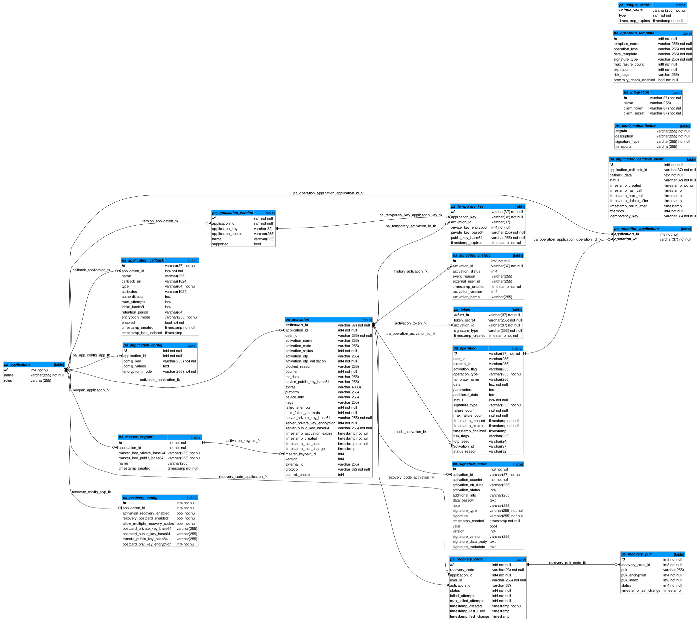

# Database Structure

<!-- TEMPLATE database -->

You can download DDL scripts for supported databases:

- [Oracle - Create Database Schema](./sql/oracle/create_schema.sql)
- [PostgreSQL - Create Database Schema](./sql/postgresql/create_schema.sql)
- [MS SQL - Create Database Schema](./sql/mssql/create_schema.sql)

See the overall database schema:

## ShedLock

The PowerAuth Server uses ShedLock to synchronize scheduled operations.
See the [SchedLock documentation](https://github.com/lukas-krecan/ShedLock#jdbctemplate) for the details.

## Table Documentation

This chapter explains individual tables and their columns. The column types are used from PostgreSQL dialect, other databases use types that are equivalent (mapping is usually straight forward).

<!-- begin database table pa_application -->
### Applications Table

Stores applications used in the PowerAuth Server.

#### Columns

| Name   | Type         | Info          | Note                                                  |
|--------|--------------|---------------|-------------------------------------------------------|
| id     | BIGINT(20)   | autoincrement | Unique application record ID.                         |
| name   | VARCHAR(255) | -             | Application identifier, for example "mobile-banking". |
<!-- end -->

<!-- begin database table pa_application_version -->
### Application Versions Table

Stores application versions for the applications stored in `pa_application` table.

#### Columns

| Name               | Type         | Info                            | Note                                                                                                                                    |
|--------------------|--------------|---------------------------------|-----------------------------------------------------------------------------------------------------------------------------------------|
| id                 | BIGINT(20)   | primary key, autoincrement      | Unique application version identifier.                                                                                                  |
| application_id     | BIGINT(20)   | foreign key: pa\_application.id | Related application ID.                                                                                                                 |
| name               | VARCHAR(255) | -                               | Version identifier.                                                                                                                     |
| application_key    | VARCHAR(255) | index                           | Application key related to this version. Should be indexed to allow a fast lookup, since this is an identifier client applications use. |
| application_secret | VARCHAR(255) | -                               | Application secret related to this version.                                                                                             |
| supported          | INT(11)      | -                               | Flag indicating if this version is supported or not (0 = not supported, 1..N = supported)                                               |
<!-- end -->

<!-- begin database table pa_application_config -->
### Application Configuration Table

Stores configurations for the applications stored in `pa_application` table.

#### Columns

| Name             | Type         | Info                               | Note                                                                                                                            |
|------------------|--------------|------------------------------------|---------------------------------------------------------------------------------------------------------------------------------|
| id               | BIGINT(20)   | primary key, autoincrement         | Unique application configuration identifier.                                                                                    |
| application_id   | BIGINT(20)   | foreign key: pa\_application.id    | Related application ID.                                                                                                         |
| config_key       | VARCHAR(255) | index                              | Configuration key names: `fido2_attestation_fmt_allowed`, `fido2_aaguids_allowed`, `fido2_root_ca_certs`, or `oauth2_providers` |
| config_values    | TEXT         | -                                  | Configuration values serialized in JSON format.                                                                                 |
| encryption_mode  | VARCHAR(255) | DEFAULT 'NO_ENCRYPTION' NOT NULL   | Encryption of config values: `NO_ENCRYPTION` means plaintext, `AES_HMAC` for AES encryption with HMAC-based index.              |
<!-- end -->

<!-- begin database table pa_activation -->
### Activations Table

Stores activations. Activation is a unit associating signature / transport and encryption keys to a specific user and application.

#### Columns

| Name                          | Type          | Info                                | Note                                                                                                                                                                               |
|-------------------------------|---------------|-------------------------------------|------------------------------------------------------------------------------------------------------------------------------------------------------------------------------------|
| activation_id                 | VARCHAR(37)   | primary key, UUID (level 4)         | Unique activation ID. Uses UUID Level 4 format, for example "099e5e30-47b1-41c7-b49b-3bf28e811fca".                                                                                |
| activation_code               | VARCHAR(255)  | index                               | Activation code used during the activation process. Uses 4x5 characters in Base32 encoding separated by a "-" character, for example "KA4PD-RTIE2-KOP3U-H53EA".                    |
| activation_otp                | VARCHAR(255)  | -                                   | Activation OTP value                                                                                                                                                               |
| activation_otp_validation     | INT(11)       | -                                   | Activation OTP validation, can be one of following values:  0 - NONE 1 - ON_KEY_EXCHANGE 2 - ON_COMMIT                                                                 |
| activation_status             | INT(11)       | -                                   | Activation status, can be one of following values:  1 - CREATED 2 - PENDING_COMMIT 3 - ACTIVE 4 - BLOCKED 5 - REMOVED                                            |
| blocked_reason                | VARCHAR(255)  | -                                   | Reason why activation is blocked (used when activation_status = 4, BLOCKED).                                                                                                       |
| activation_name               | VARCHAR(255   | -                                   | Name of the activation, typically a name of the client device, for example "John's iPhone 6"                                                                                       |
| application_id                | BIGINT(20)    | foreign key: pa\_application.id     | Associated application ID.                                                                                                                                                         |
| user_id                       | VARCHAR(255)  | index                               | Associated user ID.                                                                                                                                                                |
| counter                       | BIGINT(20)    | -                                   | Activation counter.                                                                                                                                                                |
| ctr_data                      | VARCHAR(255)  | -                                   | Activation hash based counter data.                                                                                                                                                |
| device_public_key_base64      | TEXT          | -                                   | Device public key, encoded in Base64 encoding.                                                                                                                                     |
| extras                        | VARCHAR(4000) | -                                   | Any application specific information.                                                                                                                                              |
| platform                      | VARCHAR(255)  | -                                   | User device platform.                                                                                                                                                              |
| device_info                   | VARCHAR(255)  | -                                   | User device information.                                                                                                                                                           |
| flags                         | VARCHAR(255)  | -                                   | Activation flags.                                                                                                                                                                  |
| external_id                   | VARCHAR(255)  | -                                   | External identifier related to the activation.                                                                                                                                     |
| protocol                      | VARCHAR(32)   | -                                   | Security protocol: `powerauth` (default) or `fido2`.                                                                                                                               |
| failed_attempts               | BIGINT(20)    | -                                   | Number of failed signature verification attempts.                                                                                                                                  |
| max_failed_attempts           | BIGINT(20)    | -                                   | Number of maximum allowed failed signature verification attempts. After value of "failed_attempts" matches this value, activation becomes blocked (activation_status = 4, BLOCKED) |
| server_private_key_base64     | TEXT          | -                                   | Server private key, encoded as Base64                                                                                                                                              |
| server_private_key_encryption | INT(11)       | -                                   | Indication whether server private key is encrypted (0 = no encryption, 1 = AES_HMAC)                                                                                               |
| server_public_key_base64      | TEXT          | -                                   | Server public key, encoded as Base64                                                                                                                                               |
| master_keypair_id             | BIGINT(20)    | foreign key: pa\_master\_keypair.id | Master Key Pair identifier, used during the activation process                                                                                                                     |
| timestamp_created             | DATETIME      | -                                   | Timestamp of the record creation.                                                                                                                                                  |
| timestamp_activation_expire   | DATETIME      | -                                   | Timestamp until which the activation must be committed. In case activation is not committed until this period, it will become REMOVED.                                             |
| timestamp_last_used           | DATETIME      | -                                   | Timestamp of the last signature verification attempt.                                                                                                                              |
| timestamp_last_change         | DATETIME      | -                                   | Timestamp of the last signature verification attempt.                                                                                                                              |
| version                       | BIGINT(2)     | -                                   | Cryptography protocol version.                                                                                                                                                     |
<!-- end -->

<!-- begin database table pa_master_keypair -->
### Master Key Pair Table

Stores master key pairs associated with applications and used during the activation process.

#### Columns

| Name                      | Type         | Info                            | Note                          |
|---------------------------|--------------|---------------------------------|-------------------------------|
| id                        | BIGINT(20)   | primary key, autoincrement      | Unique master key pair ID.    |
| application_id            | BIGINT(20)   | foreign key: pa\_application.id | Associated application ID.    |
| name                      | VARCHAR(255) | -                               | Name of the key pair.         |
| master_key_private_base64 | TEXT         | -                               | Private key encoded as Base64 |
| master_key_public_base64  | TEXT         | -                               | Public key encoded as Base64  |
| timestamp_created         | DATETIME     | -                               | Timestamp of creation.        |
<!-- end -->

<!-- begin database table pa_signature_audit -->
### Signature Audit Records Table

Stores the records with values used for attempts for the signature validation.

#### Columns

| Name                | Type         | Info                                       | Note                                                                      |
|---------------------|--------------|--------------------------------------------|---------------------------------------------------------------------------|
| id                  | BIGINT(20)   | primary key, autoincrement                 | Unique record ID.                                                         |
| activation_id       | BIGINT(20)   | foreign key: pa\_activation.activation\_id | Associated activation ID.                                                 |
| activation_counter  | BIGINT(20)   | -                                          | Activation counter at the moment of signature validation.                 |
| activation_ctr_data | BIGINT(2)    | -                                          | Activation hash based counter data at the moment of signature validation. |
| activation_status   | INT(11)      | -                                          | Activation status at the moment of signature validation.                  |
| additional_info     | VARCHAR(255) | -                                          | Additional information related to the signature request in JSON format.   |
| data_base64         | TEXT         | -                                          | Data passed as the base for the signature, encoded as Base64.             |
| signature_type      | VARCHAR(255) | -                                          | Requested type of the signature.                                          |
| signature           | VARCHAR(255) | -                                          | Provided value of the signature.                                          |
| signature_metadata  | TEXT         | -                                          | JSON with signature metadata related to the signature calculation.        |
| signature_data_body | TEXT         | -                                          | Data used for the signature verification.                                 |
| valid               | INT(11)      | -                                          | Flag indicating if the provided signature was valid.                      |
| note                | TEXT         | -                                          | Additional information about the validation result.                       |
| timestamp_created   | DATETIME     | index                                      | A timestamp of the validation attempt.                                    |
| version             | BIGINT(2)    | -                                          | PowerAuth protocol version.                                               |
<!-- end -->

<!-- begin database table pa_integration -->
### Integration Credentials Table

Stores credentials for applications that integrate with PowerAuth Server.

#### Columns

| Name | Type | Info | Note |
|------|------|---------|------|
| id | VARCHAR(37) | primary key | Unique integration ID, UUID Level 4 format. |
| name | VARCHAR(255) | - | Integration name, anything that visually identifies the associated application. |
| client_token | VARCHAR(37) | index | Integration username, UUID Level 4 format. |
| client_secret | VARCHAR(37) | - | Integration password, UUID Level 4 format. |
<!-- end -->

<!-- begin database table pa_application_callback -->
### Application Callback URL Table

Stores callback URLs - per-application endpoints that are notified whenever an activation or operation status changes.

#### Columns

| Name            | Type         | Info                             | Note                                                                                                                       |
|-----------------|--------------|----------------------------------|----------------------------------------------------------------------------------------------------------------------------|
| id              | VARCHAR(37)  | primary key                      | Unique callback URL identifier, UUID Level 4 format.                                                                       |
| application_id  | BIGINT(20)   | foreign key: pa\_application.id  | Associated application ID.                                                                                                 |
| name            | VARCHAR(255) | -                                | Callback name, anything that visually identifies the callback purpose.                                                     |
| callback_url    | TEXT         | -                                | Callback URL value, any URL that can receive activation update callback.                                                   |
| type            | VARCHAR(64)  | -                                | Callback type: `ACTIVATION_STATUS_CHANGE` or `OPERATION_STATUS_CHANGE`.                                                    |
| attributes      | TEXT         | -                                | Callback attributes as a key-value map, serialized into JSON.                                                              |
| authentication  | TEXT         | -                                | Callback HTTP request authentication configuration, serialized into JSON.                                                  |
| encryption_mode | VARCHAR(255) | DEFAULT 'NO_ENCRYPTION' NOT NULL | Encryption of authentication values: `NO_ENCRYPTION` means plaintext, `AES_HMAC` for AES encryption with HMAC-based index. |
| max_attempts | INTEGER | - | Maximum number of attempts to dispatch a callback. |
| initial_backoff | VARCHAR(64) | - | Initial backoff period before the next send attempt, stored as a ISO 8601 string. |
| retention_period | VARCHAR(64) | - | Minimal duration for which is a completed callback event persisted, stored as a ISO 8601 string. |
| timestamp_last_failure | DATETIME | - | The timestamp of the most recent failed callback event associated with this configuration. |
| failure_count | INTEGER | - | The number of consecutive failed callback events associated with this configuration. |
<!-- end -->

<!-- begin database table pa_token -->
### Token Store Table

Stores tokens used for token-based authentication.

#### Columns

| Name              | Type         | Info                                      | Note                                                     |
|-------------------|--------------|-------------------------------------------|----------------------------------------------------------|
| token_id          | VARCHAR(37)  | primary key                               | Unique identifier of the token.                          |
| token_secret      | VARCHAR(255) | -                                         | Secret value used for computing the token digest.        |
| activation_id     | VARCHAR(37)  | foreign key: pa\_activation.activation_id | Reference to associated activation.                      |
| signature_type    | VARCHAR(255) | -                                         | Type of the signature that was used to issue this token. |
| timestamp_created | DATETIME     | -                                         | Timestamp of the record creation.                        |
<!-- end -->

<!-- begin database table pa_activation_history -->
### Activation History Table

Stores a log of activation changes.

#### Columns

| Name               | Type         | Info                                      | Note                                                                                                                                                                            |
|--------------------|--------------|-------------------------------------------|---------------------------------------------------------------------------------------------------------------------------------------------------------------------------------|
| id                 | INT(37)      | primary key                               | Unique record ID.                                                                                                                                                               |
| activation_id      | VARCHAR(37)  | foreign key: pa\_activation.activation_id | Reference to associated activation.                                                                                                                                             |
| activation_status  | INT(11)      | index                                     | Activation status, can be one of following values:  1 - CREATED 2 - PENDING_COMMIT 3 - ACTIVE 4 - BLOCKED 5 - REMOVED                                         |
| event_reason       | VARCHAR(255) | -                                         | Reason why activation was changed.                                                                                                                                              |
| external_user_id   | VARCHAR(255) | -                                         | External user ID of user who caused change of the activation (e.g. banker user ID). In case the value is null the change was caused by the user associated with the activation. |
| timestamp_created  | DATETIME     | -                                         | Timestamp of the record creation.                                                                                                                                               |
| activation_version | INT(2)       | -                                         | Activation version                                                                                                                                                              |
<!-- end -->

<!-- begin database table pa_recovery_code -->
### Recovery Code Table

Stores information about recovery codes.

#### Columns

| Name                  | Type         | Info                                      | Note                                                                                                                                                                    |
|-----------------------|--------------|-------------------------------------------|-------------------------------------------------------------------------------------------------------------------------------------------------------------------------|
| id                    | INT(37)      | primary key                               | Unique record ID.                                                                                                                                                       |
| recovery_code         | VARCHAR(23)  | index                                     | Recovery code used for recovering an activation. Uses 4x5 characters in Base32 encoding separated by a "-" character, for example "KA4PD-RTIE2-KOP3U-H53EA".            |
| application_id        | BIGINT(20)   | foreign key: pa\_application.id           | Related application ID.                                                                                                                                                 |
| user_id               | VARCHAR(255) | index                                     | Associated user ID.                                                                                                                                                     |
| activation_id         | VARCHAR(37)  | foreign key: pa\_activation.activation_id | Reference to associated activation.                                                                                                                                     |
| status                | INT(11)      | -                                         | Recovery code status, can be one of following values:  1 - CREATED 2 - ACTIVE 3 - BLOCKED 4 - REVOKED                                                    |
| failed_attempts       | BIGINT(20)   | -                                         | Number of failed activation recovery attempts.                                                                                                                          |
| max_failed_attempts   | BIGINT(20)   | -                                         | Number of maximum allowed failed activation recovery attempts. After value of "failed_attempts" matches this value, recovery code becomes blocked (status = 3, BLOCKED) |
| timestamp_created     | DATETIME     | -                                         | Timestamp of record creation.                                                                                                                                           |
| timestamp_last_used   | DATETIME     | -                                         | Timestamp of record last usage.                                                                                                                                         |
| timestamp_last_change | DATETIME     | -                                         | Timestamp of record last change.                                                                                                                                        |
<!-- end -->

<!-- begin database table pa_recovery_puk -->
### Recovery PUK Table

Stores information about recovery PUKs.

#### Columns

| Name                  | Type         | Info                                    | Note                                                                                              |
|-----------------------|--------------|-----------------------------------------|---------------------------------------------------------------------------------------------------|
| id                    | INT(37)      | primary key                             | Unique record ID.                                                                                 |
| recovery_code_id      | INT(37)      | foreign key: pa_recovery_code.id, index | Related recovery code.                                                                            |
| puk                   | VARCHAR(255) | -                                       | Recovery PUK value (optionally encrypted).                                                        |
| puk_encryption        | INT(11)      | -                                       | Encryption type for PUK (0 = NO_ENCRYPTION, 1 = AES_HMAC)                                         |
| puk_index             | INT(11)      | index                                   | Index of the PUK (value starts by 1).                                                             |
| status                | INT(11)      | -                                       | Recovery PUK status, can be one of following values:   1 - VALID 2 - USED 3 - INVALID |
| timestamp_last_change | DATETIME     | -                                       | Timestamp of record last change.                                                                  |
<!-- end -->

<!-- begin database table pa_recovery_config -->
### Recovery Configuration Table

Stores configuration of activation recovery and recovery postcards.

#### Columns

| Name                          | Type         | Info                            | Note                                                                |
|-------------------------------|--------------|---------------------------------|---------------------------------------------------------------------|
| id                            | INT(37)      | primary key                     | Unique record ID.                                                   |
| application_id                | BIGINT(20)   | foreign key: pa\_application.id | Related application ID.                                             |
| activation_recovery_enabled   | INT(1)       | -                               | Whether activation recovery is enabled.                             |
| recovery_postcard_enabled     | INT(1)       | -                               | Whether recovery postcard is enabled.                               |
| allow_multiple_recovery_codes | INT(1)       | -                               | Whether multiple recovery codes are allowed per user.               |
| postcard_private_key_base64   | VARCHAR(255) | -                               | Base64 encoded EC server private key for recovery postcard.         |
| postcard_public_key_base64    | VARCHAR(255) | -                               | Base64 encoded EC server public key for recovery postcard.          |
| remote_public_key_base64      | VARCHAR(255) | -                               | Base64 encoded EC printing center public key for recovery postcard. |
<!-- end -->

<!-- begin database table pa_operation -->
### Operations

Table stores operations, i.e., the login attempts or payment approvals, that are created in external systems.

#### Columns

| Name                | Type         | Info        | Note                                                                                                                             |
|---------------------|--------------|-------------|----------------------------------------------------------------------------------------------------------------------------------|
| id                  | varchar(37)  | primary key | Unique operation ID.                                                                                                             |
| user_id             | varchar(255) | -           | Related user ID.                                                                                                                 |
| template_id         | bigint       | -           | Template ID used for creating the operation.                                                                                     |
| external_id         | varchar(255) | -           | Identifier in external system.                                                                                                   |
| operation_type      | varchar(255) | -           | Name of the type of operation.                                                                                                   |
| data                | text         | -           | Data of the operation that enter the final signature.                                                                            |
| parameters          | text         | -           | JSON-encoded parameters that were used while creating the operation.                                                             |
| status              | integer      | -           | Status of the operation.                                                                                                         |
| status_reason       | varchar(32)  | -           | Optional details why the status changed. The value should be sent in the form of a computer-readable code, not a free-form text. |
| signature_type      | varchar(255) | -           | Comma-separated list of allowed signature types.                                                                                 |
| failure_count       | bigint       | -           | Number of already failed attempts to approve the operation.                                                                      |
| max_failure_count   | bigint       | -           | Maximum allowed number of failed attempts when approving the operation.                                                          |
| timestamp_created   | timestamp    | -           | Timestamp of when the operation was created.                                                                                     |
| timestamp_expires   | timestamp    | -           | Timestamp of when the operation will expire.                                                                                     |
| timestamp_finalized | timestamp    | -           | Timestamp of when the operation reached the terminal state (approved, rejected, expired, etc.).                                  |
| risk_flages         | varchar(255) | -           | Risk flags for offline QR code. Uppercase letters without separator, e.g. `XFC`.                                                 |
| totp_seed           | varchar(24)  | -           | Optional TOTP seed used for proximity check, base64 encoded.                                                                     |
<!-- end -->

<!-- begin database table pa_operation_template -->
### Operation Templates

Table stores operation templates that are used while creating the operations.

#### Columns

| Name                    | Type         | Info        | Note                                                                             |
|-------------------------|--------------|-------------|----------------------------------------------------------------------------------|
| id                      | varchar(37)  | primary key | Unique template ID.                                                              |
| template_name           | varchar(255) | -           | Template name.                                                                   |
| operation_type          | varchar(255) | -           | Name of the type of operation.                                                   |
| data_template           | varchar(255) | -           | Template string for the data that will enter signature later.                    |
| signature_type          | varchar(255) | -           | Comma-separated list of allowed signature types.                                 |
| max_failure_count       | bigint       | -           | Maximum allowed number of failed attempts when approving the operation.          |
| expiration              | bigint       | -           | Operation expiration in seconds (300 = 5 minutes).                               |
| risk_flages             | varchar(255) | -           | Risk flags for offline QR code. Uppercase letters without separator, e.g. `XFC`. |
| proximity_check_enabled | boolean      | -           | Whether proximity check is enabled and TOTP seed should be generated.            |
<!-- end -->

<!-- begin database table pa_operation_application -->
### Operations

Table stores operations, i.e., the login attempts or payment approvals, that are created in external systems.

#### Columns

| Name | Type | Info | Note |
|------|------|---------|------|
| application_id | bigint | part of primary key | Related application ID. |
| operation_id | varchar(37)  | part of primary key | Related operation ID. |
<!-- end -->

<!-- begin database table pa_fido2_authenticator -->
### FIDO2 Authenticators

Table stores details about FIDO2 Authenticators.

#### Columns

| Name           | Type         | Info        | Note                                                   |
|----------------|--------------|-------------|--------------------------------------------------------|
| aaguid         | varchar(255) | primary key | Identifier of the FIDO2 authenticator.                 |
| description    | varchar(255) | -           | Human-readable description of the FIDO2 authenticator. |
| signature_type | varchar(255) | -           | Signature type provided by the FIDO2 authenticator.    |
| transport      | varchar(255) | -           | JSON array of transport hints for WebAuthn ceremonies. |
<!-- end -->

<!-- begin database table pa_temporary_key -->
### Temporary Keys

Table stores details about temporary key pairs used for data encryption.

#### Columns

| Name                   | Type         | Info                                                   | Note                                                                                  |
|------------------------|--------------|--------------------------------------------------------|---------------------------------------------------------------------------------------|
| id                     | varchar(37)  | primary key                                            | Identifier of the temporary key pair.                                                 |
| application_key        | varchar(32)  | foreign key: pa\_application\_version.application\_key | Identifier of the application version (app key).                                      |
| activation_id          | varchar(37)  | foreign key: pa\_activation.activation\_id             | Identifier of an associated activation (activation ID).                               |
| private_key_encryption | integer      | -                                                      | Indication whether server private key is encrypted (0 = no encryption, 1 = AES_HMAC). |
| private_key_base64     | varchar(255) | -                                                      | Temporary private key encoded as Base64.                                              |
| public_key_base64      | varchar(255) | -                                                      | Temporary public key encoded as Base64.                                               |
| timestamp_expires      | timestamp    | index                                                  | Timestamp of when the temporary key pair expires.                                     |

<!-- begin database table pa_application_callback_event -->
### Callback URL Events

Table stores Callback URL Events to monitor processing of the callbacks.

#### Columns

| Name                    | Type        | Info                                      | Note                                                                               |
|-------------------------|-------------|-------------------------------------------|------------------------------------------------------------------------------------|
| id                      | bigint      | primary key                               | Identifier of the Callback URL Event.                                              |
| application_callback_id | varchar(37) | foreign key: pa\_application\_callback.id | Reference to configuration of the Callback URL Event.                              |
| callback_data           | text        | -                                         | Data payload of the Callback URL Event.                                            |
| status                  | varchar(32) | -                                         | Current status of the Callback URL Event.                                          |
| timestamp_created       | timestamp   | -                                         | Timestamp of the Callback URL Event creation.                                      |
| timestamp_last_call     | timestamp   | -                                         | Timestamp of the last attempt to send the Callback URL Event.                      |
| timestamp_next_call     | timestamp   | -                                         | Timestamp of the next scheduled time to send the Callback URL Event.               |
| timestamp_delete_after  | timestamp   | -                                         | Timestamp after which the Callback URL Event record can be deleted from the table. |
| timestamp_rerun_after   | timestamp   | -                                         | Timestamp after which the Callback URL Event in processing state will be rerun.    |
| attempts                | integer     | -                                         | Number of dispatch attempts made for the Callback URL Event.                       |
| idempotency_key         | varchar(36) | -                                         | Idempotency key associated with the Callback URL Event.                            |
<!-- end -->
